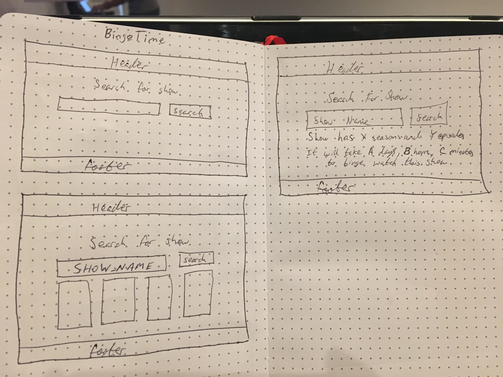

*** Philip Zak / 9.11.17 ***

# BingeTime Proposal

## What is BingeTime?

BingeTime is a simple app where a visitor can search for a show, and the result will be how many seasons and episodes the show has and how long it will take to binge watch the show. The user can also create an account, so they can save the shows they are binge watching.

## Wireframe

## Initial thoughts on app structure
The app will have a simplistic design. User will be presented with a search field so they can search for a show. After selecting their show, the user will be presented with the amount of seasons and episodes the show has and how long it will take to watch all the episodes. If the user makes an account, they can save the shows they want to binge watch. On their profile page, they will see all the shows they want to binge watch and a total time to watch all the shows they saved.

## User Stories
When visiting the site, the user will be will see a search bar. The user can search for a show. After selecting the show, the user will see how many seasons and episodes the show has and how long it will take to watch the show. If the user has an account, they can favorite the show and on their profile page they will see all their favorite shows and the time it will take to watch all their shows.

## Phases of Completion

### Phase 0
- run terminal commands to create app skeleton

### Phase 1
- get search functionality working
  - console log response
- filter respone for data that i need
  - console log filtered response

### Phase 2
- display filtered data in the browser

### Phase 3
- let visitors create accounts

### Phase 4
- let users save shows

### Phase 5
- display user's favorites on their profile page
- display how many shows user has
- display how long it will take user to watch all their shows

### Phase 6
- make site look pretty

## Links and Resources
[TheMovieDb](https://www.themoviedb.org/documentation/api)

[TVMaze](https://www.tvmaze.com/api)